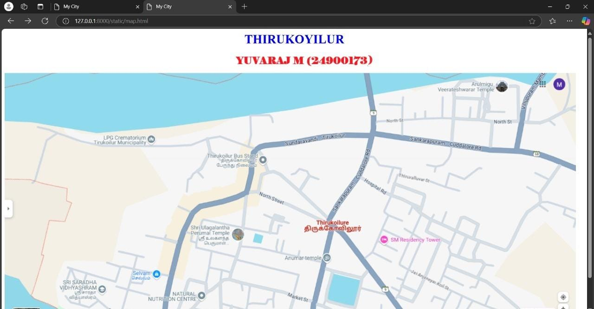
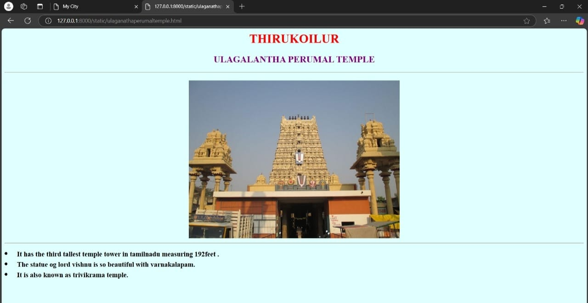
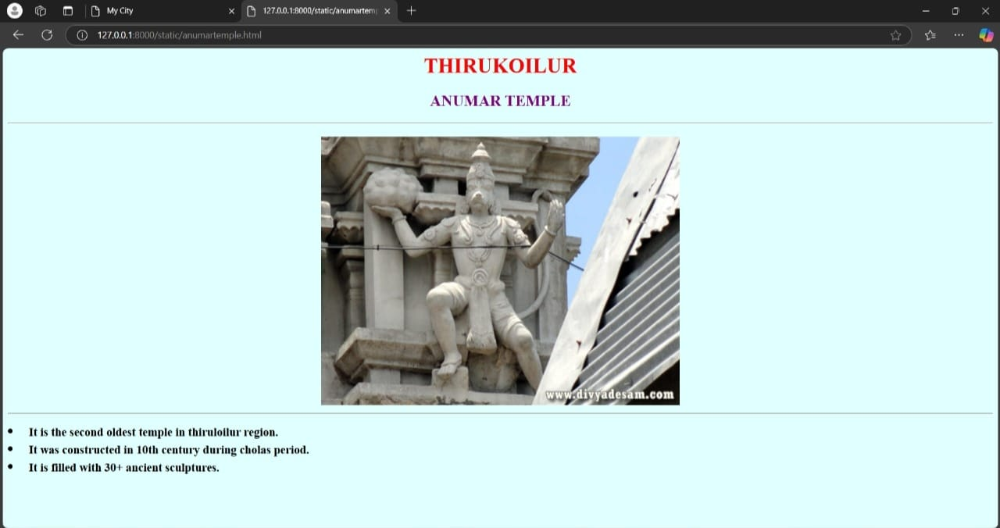
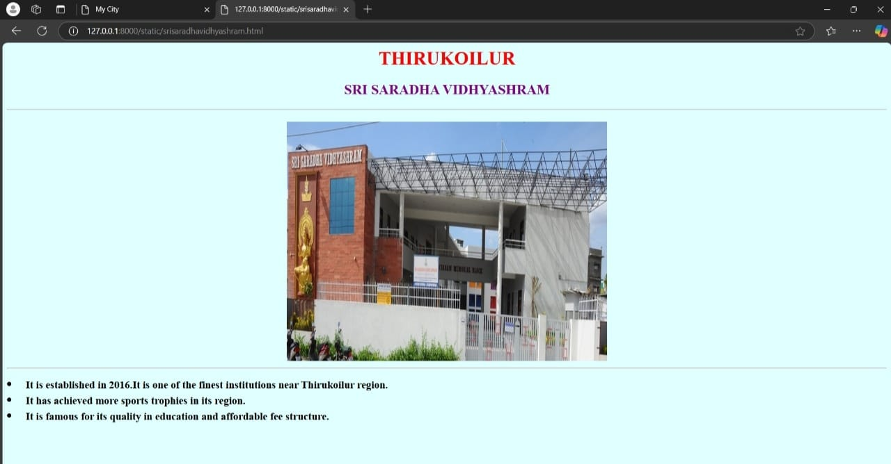
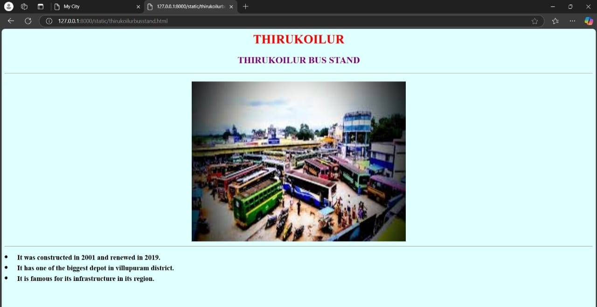

# Ex04 Places Around Me
## Date: 

## AIM
To develop a website to display details about the places around my house.

## DESIGN STEPS

### STEP 1
Create a Django admin interface.

### STEP 2
Download your city map from Google.

### STEP 3
Using ```<map>``` tag name the map.

### STEP 4
Create clickable regions in the image using ```<area>``` tag.

### STEP 5
Write HTML programs for all the regions identified.

### STEP 6
Execute the programs and publish them.

## CODE
      '''
     map.html
    <html>
    <head>
        <title>My City</title>   
    </head>
    <body>
        <h1 align="center">
            <font color="blue"><b>THIRUKOYILUR</b></font>
        </h1>
        <h2 align="center">
            <font color="red"><b> Yuvaraj .M(24900173)</b></font> </h2>
      </h3 align="center">
        
        <map name="image-map">
    <area target="" alt="Ulagalanantha perumal temple" title="Ulagalanantha perumal temple" href="ulaganathaperumaltemple.html" coords="456,386,614,448" shape="rect">
    <area target="" alt="Thirukoilur Bus Stand" title="Thirukoilur Bus Stand" href="thirukoilurbusstand.html" coords="511,197,680,252" shape="rect">
    <area target="" alt="Anumar temple" title="Anumar temple" href="anumartemple.html" coords="711,454,856,496" shape="rect">
    <area target="" alt="Saradha Vidhyashram" title="Saradha Vidhyashram" href="srisaradhavidhyashram.html" coords="134,518,268,588" shape="rect">
    <area target="" alt="Veerateshwarar temple" title="Veerateshwarar temple" href="veerateshwarartemple.html" coords="1106,12,1316,51" shape="rect">
     </map>
    </h3>
    </body>
    </html>

srisaradhavidhyashram.html

    <html>

    <body bgcolor="#E0FFFF">
    <h1 align="center">
        <font color="red">
           THIRUKOILUR
        </font>
    </h1>
    <h2 align="center">
        <font color="purple">
            SRI SARADHA VIDHYASHRAM 
        </font>
    </h2>
    <hr>
    <h2>
        <center>
            
        <hr>
        <li align="left">
            <font size="4">
                It is established in 2016.It is one of the finest institutions near Thirukoilur region.
            </font>
        </li>
        <li align="left">
            <font size="4">
                It has achieved more sports trophies in its region.
            </font>
        </li>
        <li align="left">
            <font size="4">
               It is famous for its quality in education and affordable fee structure.
            </font>
        
    </h2>
    </body>

    </html>

thirukoilurbusstand.html

    <html>

     <body bgcolor="#E0FFFF">
    <h1 align="center">
        <font color="red">
           THIRUKOILUR
        </font>
    </h1>
    <h2 align="center">
        <font color="purple">
            SRI SARADHA VIDHYASHRAM 
        </font>
    </h2>
    <hr>
    <h2>
        <center>
            
        <hr>
        <li align="left">
            <font size="4">
                It is established in 2016.It is one of the finest institutions near Thirukoilur region.
            </font>
        </li>
        <li align="left">
            <font size="4">
                It has achieved more sports trophies in its region.
            </font>
        </li>
        <li align="left">
            <font size="4">
               It is famous for its quality in education and affordable fee structure.
            </font>
        
    </h2>
    </body>

     </html>

veerateshwarartemple.html 

     <html>

     <body bgcolor="#E0FFFF">
    <h1 align="center">
        <font color="red">
            THIRUKOILUR
        </font>
    </h1>
    <h2 align="center">
        <font color="purple">
            VEERATESHWARAR TEMPLE
        </font>
    </h2>
    <hr>
    <h2>
        <center>
            
        <hr>
        <li align="left">
            <font size="4">
            It is also called thirukoilur veeratam.
            </font>
        </li>
        <li align="left">
            <font size="4">
             It is constructed in dravidian style of architecture during cholas period.   
            </font>
        </li>
        <li align="left">
            <font size="4">
             The temple covers nearly 5 acres near Thenpennai river.  
            </font>
        
    </h2>
     </body>

    </html>

anumartemple.html

    <html>

    <body bgcolor="#E0FFFF">
    <h1 align="center">
        <font color="red">
            THIRUKOILUR
        </font>
    </h1>
    <h2 align="center">
        <font color="purple">
            ANUMAR TEMPLE
        </font>
    </h2>
    <hr>
    <h2>
        <center>
            
        <hr>
        <li align="left">
            <font size="4">
              It is the second oldest temple in thiruloilur region.  
            </font>
        </li>
        <li align="left">
            <font size="4">
            It was constructed in 10th century during cholas period.    
            </font>
        </li>
        <li align="left">
            <font size="4">
             It is filled with 30+ ancient sculptures.  
            </font>
        
    </h2>
    </body>

    </html>

ulaganathaperumaltemple.html

    <html>

    <body bgcolor="#E0FFFF">
    <h1 align="center">
        <font color="red">
            THIRUKOILUR
        </font>
    </h1>
    <h2 align="center">
        <font color="purple">
           ULAGALANTHA PERUMAL TEMPLE
        </font>
    </h2>
    <hr>
    <h2>
        <center>
            
        <hr>
        <li align="left">
            <font size="4">
            It has the third tallest temple tower in tamilnadu measuring 192feet .
            </font>
        </li>
        <li align="left">
            <font size="4">
             The statue og lord vishnu is so beautiful with varnakalapam.   
            </font>
        </li>
        <li align="left">
            <font size="4">
            It is also known as trivikrama temple. 
            </font>
        
    </h2>
    </body>

     </html>

## OUTPUT











## RESULT
The program for implementing image maps using HTML is executed successfully.
